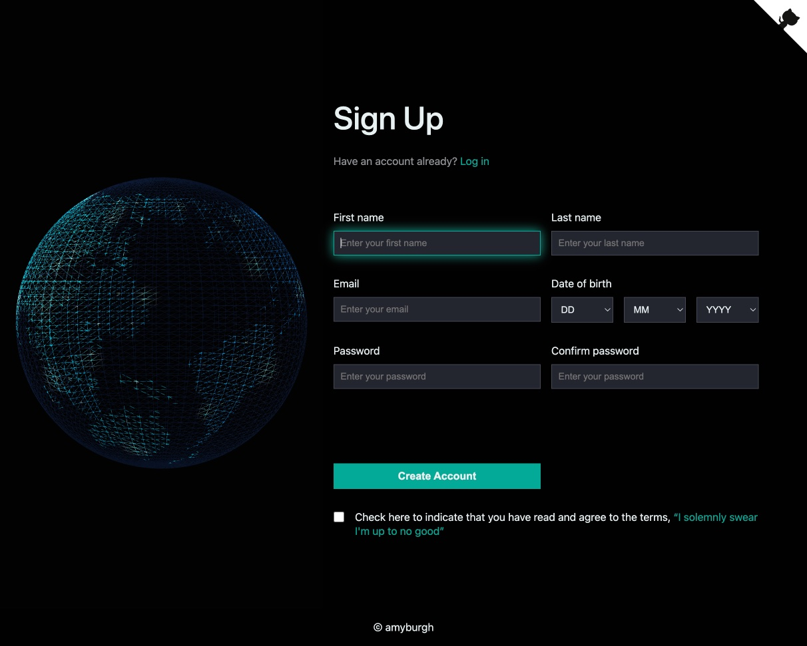

# Sign-Up Form

This project is an interactive sign-up form created with HTML, CSS, and JavaScript. It features a 3D design created with [Spline.design](https://spline.design/), a tool for creating interactive 3D scenes and models built on top of [three.js](https://threejs.org/).

## Features

- Date of birth input handled by [date-of-birth.js](date-of-birth.js)
- Client-side password validation implemented in [password-validation.js](password-validation.js) (Note: this is not a replacement for server-side validation)

## Usage

To use this form, open [index.html](index.html) in your browser.

## Preview

You can preview the form by clicking on the image below, which will redirect you to the hosted version of the form.

## Note

This project is for demonstration purposes and does not include server-side validation or form submission.
